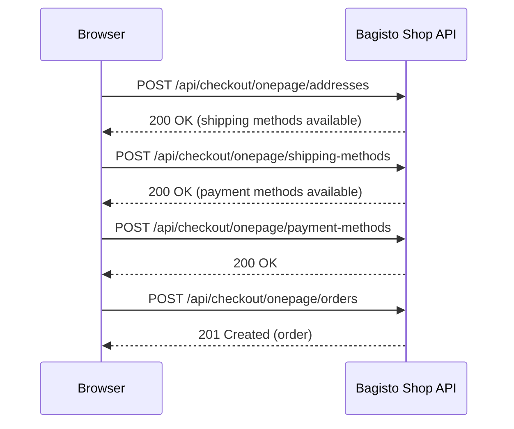
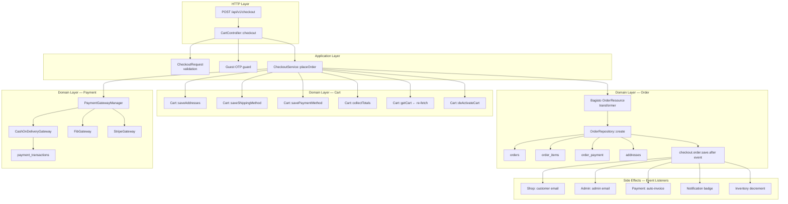
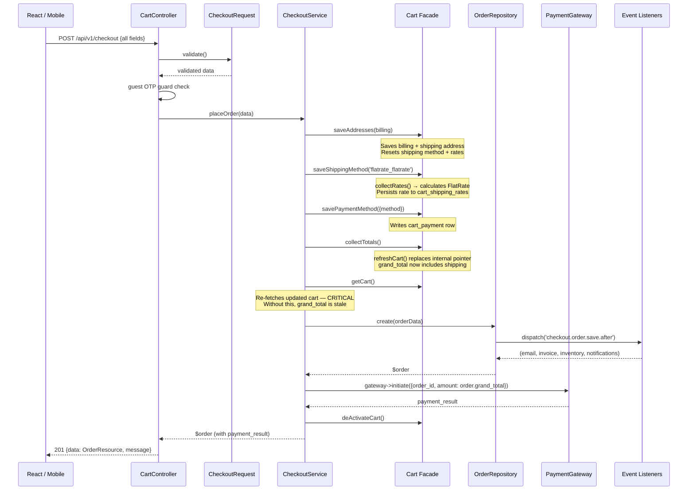

# ADR-001: Single-Request Checkout Pipeline

| Field | Value |
|---|---|
| **ID** | ADR-001 |
| **Status** | Accepted |
| **Date** | 2026-06-27 |
| **Authors** | Kurdistan Store engineering |
| **Supersedes** | — |
| **Superseded by** | — |

---

## Table of Contents

1. [Context](#context)
2. [Decision](#decision)
3. [Alternatives Considered](#alternatives-considered)
4. [Consequences](#consequences)
5. [Important Invariants](#important-invariants)
6. [Security Considerations](#security-considerations)
7. [Operational Considerations](#operational-considerations)
8. [Future Evolution](#future-evolution)
9. [Lessons Learned](#lessons-learned)
10. [References](#references)

---

## Context

### Bagisto's Default Checkout Architecture

Bagisto 2.4's built-in shop checkout is a **multi-request, multi-step flow** designed for a traditional web storefront. Completing an order requires at least four separate HTTP round-trips:



Each step is stateful: later steps depend on data saved by earlier ones. The shipping-method step requires shipping rates that were collected during the address step. The order-creation step requires a payment method saved in the payment step. If steps are skipped or arrive out of order, the order cannot be created.

This design is appropriate for Bagisto's built-in Vue.js storefront, where each step renders a new UI panel and the user must consciously advance through a wizard. It is **not appropriate** for Kurdistan Store.

### Kurdistan Store's Requirements

Kurdistan Store is a mobile-first, single-page React application targeting customers in the Kurdistan Region of Iraq. The storefront requirements drove the following constraints:

**Single-screen checkout.** The checkout experience is a single form. The customer fills in their name, phone, address, and delivery pin on one screen and taps "Place Order." There is no shipping selection step (there is one carrier), no payment wizard (COD is the default, with online options behind a toggle), and no server-side session to shepherd the user through steps.

**Single-page application architecture.** The React frontend communicates with the backend exclusively through the `api/v1` JSON API. Bagisto's built-in checkout routes (`/api/checkout/onepage/*`) are coupled to Bagisto's Vue.js session handling and return response shapes the custom frontend does not consume.

**Low-connectivity resilience.** Customers in Iraqi cities frequently experience intermittent mobile connections. Each additional HTTP round-trip is an opportunity for a partial failure that leaves the cart in an inconsistent intermediate state. Minimising round-trips minimises the surface area for partial failures.

**Future mobile-app parity.** The `api/v1` layer is designed to be the single API contract for both the React web app and any future iOS/Android native applications. A multi-step API would require mobile clients to implement step-ordering logic that belongs in the server.

**No multi-step state to manage on the frontend.** Bagisto's multi-step checkout requires the frontend to track which step is current, what data was returned by previous steps, and how to handle partial failures at each transition. This is state that has no business value — it exists purely to satisfy a protocol. Moving it to the server eliminates an entire class of frontend bugs.

### The Goal

Design a checkout that accepts the complete customer intent in one request, performs all server-side orchestration internally, and returns either a completed order or a structured error — with no intermediate states visible to the client.

---

## Decision

**Implement checkout as a single `POST /api/v1/checkout` endpoint backed by `CheckoutService::placeOrder()`.**

All orchestration — address persistence, shipping selection, payment selection, total recalculation, order creation, payment initiation, and cart teardown — occurs within a single synchronous service method called within a single HTTP request.

### Component Architecture



### Sequence Diagram



### CheckoutService Responsibilities

[`src/Services/Checkout/CheckoutService.php`](../../packages/Store/KurdistanStore/src/Services/Checkout/CheckoutService.php)

The service executes the following steps **in strict order**. The ordering is not arbitrary — it encodes dependencies between Bagisto's internal subsystems (see [Important Invariants](#important-invariants)).

| # | Operation | Method | Why it must be here |
|---|---|---|---|
| 1 | **Validate cart is non-empty** | — | Fail fast before any DB writes |
| 2 | **Save addresses** | `Cart::saveAddresses()` | Shipping address must exist before rates can be collected |
| 3 | **Select shipping method** | `Cart::saveShippingMethod()` | Rates are calculated and persisted; `shipping_method` is set on cart |
| 4 | **Select payment method** | `Cart::savePaymentMethod()` | Writes `cart_payment` row that `OrderResource` reads |
| 5 | **Recalculate totals** | `Cart::collectTotals()` | Computes grand_total including shipping; rewrites cart in DB |
| 6 | **Re-fetch cart** | `Cart::getCart()` | Retrieves the updated cart object post-`refreshCart()` (invariant §5.1) |
| 7 | **Load payment relation** | `$cart->load('payment')` | Hydrates relation that was written to DB in step 4 but not set in memory |
| 8 | **Transform cart to order data** | `OrderResource($cart)` | Bagisto's canonical cart-to-order mapping |
| 9 | **Create order** | `OrderRepository::create()` | Persists all order rows; dispatches events |
| 10 | **Persist delivery location** | Direct SQL on `addresses` | Bypasses Eloquent fillable to persist custom coordinates |
| 11 | **Persist customer notes** | `OrderComment::create()` | Attaches note as an order comment |
| 12 | **Initiate payment** | `gateway->initiate()` | Amount is `$order->grand_total` — must be called after step 9 |
| 13 | **Deactivate cart** | `Cart::deActivateCart()` | Prevents the cart from being reused after order creation |

Steps 10 and 11 are Kurdistan Store additions. All other steps use Bagisto's public API surface.

---

## Alternatives Considered

### Alternative A: Use Bagisto's default multi-step checkout endpoints

**Description:** Use the existing `/api/checkout/onepage/*` routes with the React frontend making four sequential requests.

**Advantages:**
- Zero custom code in the checkout pipeline.
- Bagisto upgrades apply automatically.
- Complete test coverage from Bagisto's own test suite.

**Disadvantages:**
- The response shapes are tightly coupled to Bagisto's Vue.js frontend and include UI-specific fields the React app does not need.
- The four-request sequence introduces three additional failure points. A network error between step 2 and step 3 leaves the cart with shipping selected but no payment — the customer cannot complete checkout without refreshing.
- Cart state must be managed client-side across requests. If the customer navigates away between steps, recovery logic is needed.
- The session-based cart identification conflicts with the token-authenticated API model used by `api/v1`. Guest carts would require separate session handling.
- Bagisto's onepage checkout requires the shipping step to return available methods to the frontend for display. With a single hardcoded carrier, this round-trip is purely mechanical overhead.

**Verdict: Rejected.** The coupling to Bagisto's UI model, the multi-step failure surface, and the session/token conflict made this incompatible with Kurdistan Store's API contract.

---

### Alternative B: Multiple frontend API calls to `api/v1` (custom multi-step)

**Description:** Build a custom multi-step checkout API under `api/v1` with separate endpoints for each step:
- `POST /api/v1/checkout/address`
- `GET /api/v1/checkout/shipping-rates`
- `POST /api/v1/checkout/shipping`
- `POST /api/v1/checkout/payment`
- `POST /api/v1/checkout/confirm`

**Advantages:**
- Each step is smaller and easier to test in isolation.
- The shipping-rates endpoint would allow future multi-carrier selection without changing the checkout endpoint.
- Closer to REST conventions where each resource is independently addressable.

**Disadvantages:**
- Intermediate cart states are observable and must be considered valid states the system can recover from.
- Error handling becomes distributed: if `POST /shipping` succeeds but `POST /confirm` fails, the frontend must decide whether to retry from the last step or restart from scratch.
- The frontend must maintain step state (which steps are complete, what data was returned by each).
- For the current product (one carrier, one default payment method), all this structure exists to carry no meaningful customer choice.
- Testing requires choreographing multiple request sequences to verify end-to-end correctness.

**Verdict: Rejected.** The increased complexity is not justified by the current feature set. The single-step design can evolve to multi-step later (see [Future Evolution](#future-evolution)) if needed; the reverse is significantly more disruptive.

---

### Alternative C: Move more logic into the frontend

**Description:** Have the frontend pre-calculate shipping costs, assemble the order payload, and send a fully-formed order directly.

**Advantages:**
- Simpler server-side code.
- The frontend has full control over the checkout UX.

**Disadvantages:**
- Business logic that must be authoritative (shipping cost, discount eligibility, stock availability) cannot be trusted from the client. A crafted request could submit a shipping amount of 0 or a price below the product's actual price.
- Tax calculations, promotional rules, and inventory checks must run server-side regardless.
- Duplicating business rules in two places (frontend display and backend validation) is a maintenance liability — they will diverge.

**Verdict: Rejected.** Any financial calculation that affects what the customer pays must be computed and authorised server-side. Client-provided totals are rejected by the current implementation.

---

### Alternative D: Modify Bagisto core packages

**Description:** Patch `Webkul\Sales\Repositories\OrderRepository`, `Webkul\Checkout\Cart`, or `Webkul\Sales\Transformers\OrderResource` to accommodate Kurdistan Store's requirements directly.

**Advantages:**
- Changes live in the package where the related logic resides.
- No additional service layer.

**Disadvantages:**
- Bagisto core packages are managed by `composer update`. Any patch would be overwritten on the next upgrade unless forked or tracked separately.
- Forking core packages means owning all security patches and bug fixes in those packages indefinitely.
- Bagisto's internal APIs are not versioned or stability-guaranteed. Core patches are fragile against upstream changes.
- The existing public API surface (`Cart::saveAddresses()`, `Cart::collectTotals()`, etc.) is sufficient for all required operations. There is no need to modify internals to achieve the desired behavior.

**Verdict: Rejected.** Kurdistan Store's policy is to treat `packages/Webkul/*` as immutable vendor code. All custom behavior is expressed through the public API surface, event listeners, and the `Store\KurdistanStore` package. The single exception is direct SQL on the `addresses` table to persist `delivery_latitude` and `delivery_longitude`, which bypasses Eloquent fillable guards that cannot be changed without modifying core. This is documented as a known workaround.

---

## Consequences

### Benefits

**Simpler frontend.** The React application submits one request and receives one response. It holds no checkout state between requests and requires no retry or step-recovery logic. The checkout form is a controlled form component with a single submit handler.

**Fewer network round-trips.** A customer on a slow mobile connection completes checkout with one outbound request rather than four. This is the difference between a checkout that works reliably on 3G and one that frequently stalls mid-flow.

**Predictable failure surface.** Because all server-side operations execute within one request, there are no observable intermediate states. Either the order is created and all associated data is consistent, or nothing is created. There is no "address saved but no shipping selected" state for the frontend to recover from.

**Centralised business logic.** All checkout rules (address requirements, shipping method selection, payment gateway routing, total calculation) live in one place. Adding a new rule does not require changes across multiple endpoints or multiple frontend handlers.

**Single API contract for all clients.** The same `POST /api/v1/checkout` works identically for the web frontend, any future iOS/Android app, and any third-party integration. The client does not need to implement multi-step orchestration.

**Testability at one seam.** The entire checkout flow is exercised by calling `CheckoutService::placeOrder()` with a validated data array. Integration tests can verify the complete flow — addresses, shipping, payment, totals, order creation, cart teardown — in a single test setup.

### Trade-offs

**`CheckoutService` is an orchestrator.** The service's primary value is sequencing. It has more lines that call other things than lines that compute things. This makes it a critical coordination point: a change to the order of operations can produce incorrect totals, missing addresses, or duplicate payment attempts. New developers must read §5 (Important Invariants) before modifying it.

**Bagisto's internal invariants must be actively preserved.** Because the service bypasses Bagisto's multi-step controller flow, it must replicate the ordering that Bagisto assumes. For example, `saveAddresses()` must be called before `saveShippingMethod()` because the address-saving step creates the shipping address that `collectRates()` requires to persist rates. This coupling to Bagisto's internal state machine is not expressed in any interface — it is an invariant encoded in behaviour.

**`collectTotals()` has a hidden side effect on object identity.** See §5.1. This is the most significant operational risk in the codebase and the source of the bug that affected orders 1–25.

**All side effects are synchronous.** Order confirmation emails, admin notifications, inventory decrements, and invoice creation all run during the checkout HTTP request. A slow SMTP server increases checkout latency. A crashed email listener does not prevent the order from being created, but it may delay or skip the customer's confirmation email.

**The service is currently not transactional end-to-end.** `OrderRepository::create()` wraps order creation in a database transaction, but the delivery coordinate update (step 10), the payment initiation (step 12), and the cart deactivation (step 13) execute outside that transaction. If the payment gateway call fails after order creation, the order exists in the database without a payment record. This is acceptable for COD but becomes an issue if online payment gateways are activated synchronously.

---

## Important Invariants

> These are the rules that, if violated, produce silent data corruption rather than visible errors. Read this section before making any change to `CheckoutService`, the Cart facade, or `OrderRepository`.

### 5.1 — The Cart Refresh Invariant (Critical)

**Rule:** `Cart::getCart()` must be called **after** `Cart::collectTotals()`, not before. The local `$cart` variable must be obtained from the re-fetch.

**Why this invariant exists:**

`Cart::collectTotals()` calls `$this->refreshCart()` internally:

```php
// packages/Webkul/Checkout/src/Cart.php:868
public function refreshCart(): void
{
    $this->cart = $this->cartRepository->find($this->cart->id);
    //            ^^^^^^^^^^^^^^^^^^^^^^^^^^^^^^^^^^^^^^^^^^^
    //            Replaces the singleton's $this->cart pointer
    //            with a brand-new Eloquent model instance.
}
```

After this call, the Cart facade singleton's `$this->cart` field points to a **new PHP object** (Object B). Any local variable that was assigned `Cart::getCart()` before `collectTotals()` ran holds a reference to the **old object** (Object A). In PHP, objects are passed by reference — but reassigning `$this->cart` in the singleton does not update other variables that were previously assigned the old reference.

```
BEFORE collectTotals():
  Cart singleton.$this->cart  →  Object A { grand_total: 34000 }
  local $cart                 →  Object A { grand_total: 34000 }

collectTotals() runs:
  Cart singleton.$this->cart  →  Object B { grand_total: 34010 } ← updated
  local $cart                 →  Object A { grand_total: 34000 } ← STALE

AFTER re-fetch with Cart::getCart():
  local $cart                 →  Object B { grand_total: 34010 } ← correct
```

**The bug this produced (orders 1–25):**

```php
// WRONG — pre-fix code (illustrative):
$cart = Cart::getCart();          // Object A captured here

Cart::saveShippingMethod(...);    // shipping rate saved to DB
Cart::collectTotals();            // Object A replaced with Object B in singleton
                                  // Object B.grand_total = 34010 (with shipping) ✓
                                  // Object A.grand_total = 34000 (without shipping) ✗

$orderData = new OrderResource($cart);  // $cart is still Object A!
// → orders.grand_total stored as 34000 (missing 10 IQD shipping)
// → payment gateway charged 34000 (customer underpaid)
// → orders.shipping_amount stored as 10 (correct, lazy-loaded from DB)
// → orders table is now internally inconsistent
```

This affected 23 of the first 25 orders (all except orders 2 and 16, where the cart had fortuitously had its totals computed with shipping active in a prior request).

**The fix:**

```php
Cart::collectTotals();
$cart = Cart::getCart();   // Re-fetch Object B from the singleton
                           // No additional DB query — getCart() returns $this->cart
$cart->load('payment');    // Hydrate payment relation (not loaded by refreshCart)
```

**Why `OrderResource` must not be responsible for this re-fetch:**

`Webkul\Sales\Transformers\OrderResource` is a pure transformer. Its single responsibility is mapping a given cart object to an order data array. If it were to call `Cart::getCart()` internally, it would acquire a hidden dependency on the Cart singleton — a global side effect that makes the transformer untestable in isolation, breaks any context where the transformer is used without a Cart singleton (e.g., admin order editing), and violates the single-responsibility principle. The caller (`CheckoutService`) owns the cart lifecycle and is the correct place to ensure the correct object is passed.

**Why Bagisto's internals should remain unmodified here:**

`refreshCart()` is correct behavior. Bagisto calls it to ensure tax and shipping calculations observe a consistent DB-backed state, not an in-memory accumulation of partial writes. Removing or bypassing it would cause tax calculations to operate on stale item data. The correct response is to call `Cart::getCart()` after `collectTotals()` in the application layer — not to change what `collectTotals()` does.

---

### 5.2 — The Address-Before-Shipping Invariant

**Rule:** `Cart::saveAddresses()` must always be called **before** `Cart::saveShippingMethod()`.

**Why:**

`Cart::saveShippingMethod(code)` → `Shipping::isMethodCodeExists(code)` → `Shipping::collectRates()` → `Shipping::saveAllShippingRates()`.

`saveAllShippingRates()` does:

```php
$shippingAddress = $cart->shipping_address;
if (! $shippingAddress) {
    return;   // rates NOT persisted if no shipping address
}
```

If no shipping address exists at the time `saveShippingMethod()` is called, the rates are calculated but not saved. `cart_shipping_rates` remains empty. When `collectTotals()` later queries `$cart->selected_shipping_rate`, it returns null. Shipping is not added to `grand_total`. The order is created with `shipping_amount = 0` and `grand_total = sub_total`.

`Cart::saveAddresses()` creates the shipping address (from the billing address when `use_for_shipping = true`). It must complete before `saveShippingMethod()` is called.

---

### 5.3 — The Shipping-Reset Side Effect of saveAddresses

**Rule:** Never assume shipping rates persist across a `Cart::saveAddresses()` call.

**Why:**

`Cart::saveAddresses()` always calls `$this->resetShippingMethod()` at the end:

```php
// packages/Webkul/Checkout/src/Cart.php
public function saveAddresses(array $params): void
{
    $this->updateOrCreateBillingAddress($params['billing']);
    $this->updateOrCreateShippingAddress($params['shipping'] ?? []);
    $this->setCustomerPersonnelDetails();
    $this->resetShippingMethod();   // ← wipes all shipping rates and sets method=null
}
```

This is intentional: when a customer changes their delivery address, previously cached rates (which may have been zone-dependent) are invalidated. `saveShippingMethod()` must always be called **after** `saveAddresses()` to repopulate rates for the new address.

---

### 5.4 — The `isMethodCodeExists` Side Effect

**Rule:** Calling `Shipping::isMethodCodeExists()` deletes and rewrites all shipping rates for the current cart. Do not call it outside `saveShippingMethod()` expecting rates to be preserved from a prior call.

**Why:**

```php
public function isMethodCodeExists($code)
{
    $shippingMethods = $this->collectRates()['shippingMethods'] ?? [];
    //                      ^^^^^^^^^^^^^
    //                      Calls removeAllShippingRates() then saveAllShippingRates()
}
```

`collectRates()` always starts by deleting all existing rates (`$cart->shipping_rates()->delete()`). Each call to `isMethodCodeExists()` produces a fresh set of rates in the database.

---

### 5.5 — The `haveStockableItems()` Condition in OrderResource

**Rule:** Shipping fields (`shipping_amount`, `shipping_title`, `shipping_method`, `shipping_address`) are only included in the order data if the cart contains at least one stockable item.

**Why:**

```php
// packages/Webkul/Sales/src/Transformers/OrderResource.php:27
if ($this->haveStockableItems()) {
    $shippingInformation = [
        'shipping_amount' => $this->selected_shipping_rate->price,
        // ...
    ];
}
// ...
$this->mergeWhen($this->haveStockableItems(), $shippingInformation),
```

For a cart containing only virtual products (downloads, subscriptions), Bagisto intentionally omits shipping fields from the order. This is correct behavior for virtual-only orders. For Kurdistan Store's current product catalogue (all physical goods), `haveStockableItems()` always returns true. **If a virtual product type is introduced**, test order creation explicitly to verify that shipping is handled correctly.

---

### 5.6 — The 404-Not-403 Ownership Rule

**Rule:** `OrderController::show()` must return `404` when an order exists but belongs to a different customer. It must never return `403`.

**Why:**

A `403 Forbidden` response confirms to an attacker that an order with the given ID exists. An attacker systematically probing sequential IDs would be able to map the database's order count and discover IDs belonging to other customers. By returning `404`, the existence of the order is not confirmed. An attacker cannot distinguish "this order doesn't exist" from "this order exists but is not yours."

```php
if ((int) $order->customer_id !== (int) $customer->id) {
    abort(404);   // Do not change to 403
}
```

The type cast `(int)` is deliberate: it guards against PHP loose-comparison issues where a null `customer_id` could match a falsy authenticated user ID.

---

### 5.7 — Payment Gateway Must Receive the Post-Order Grand Total

**Rule:** `gateway->initiate()` must be called **after** `OrderRepository::create()`, using `$order->grand_total`, not `$cart->grand_total`.

**Why:**

The order's `grand_total` is what is actually recorded in the database as the amount due. Using the cart's `grand_total` would introduce a race condition where an administrative price change between cart creation and order creation could result in charging the customer a different amount than what the order records. By reading `$order->grand_total` after the order row is written, the payment initiation and the order record are guaranteed to reference the same amount.

---

## Security Considerations

### Authentication model

The `POST /api/v1/checkout` endpoint uses the `web` middleware, which resolves both session-based and Sanctum token-based authentication. An authenticated customer bypasses the OTP verification gate entirely, as their phone was verified at registration. The `auth:sanctum,customer` guard applies to the order-reading endpoints (`GET /api/v1/orders`).

### Guest checkout OTP requirement

Guest customers must complete phone OTP verification before checkout is accepted. The `CartController::checkout()` gate checks:

1. `cart->additional['phone_verified_at']` exists (OTP was completed)
2. The verification is less than 30 minutes old (freshness check)
3. The submitted `phone` matches `cart->additional['verified_phone']` after E.164 normalisation

Point 3 prevents phone substitution: a customer cannot OTP-verify one number, then submit a different phone number in the checkout payload. The normalisation is performed by `CheckoutRequest::prepareForValidation()` before validation rules run, ensuring the comparison uses a canonical form.

The OTP verification itself (`POST /api/v1/auth/verify-otp`) mutates auth state — it calls `Auth::login()` and regenerates the session. This endpoint is **not** for registration phone verification; see the route file comment and `OtpController::verify()` for the distinction.

### Order ownership

Order ownership is enforced by `OrderController`. The controller uses `OrderRepository::findOrFail($id)` to retrieve the order (returning 404 if the ID does not exist), then re-checks ownership with a cast comparison and aborts 404 if the order belongs to a different customer. See §5.6 for the rationale for 404 rather than 403.

### What checkout does not authorise

The checkout endpoint does not validate that:
- Product prices match the current catalogue (a price change between cart-add and checkout is accepted)
- Inventory is still available (this is handled by Bagisto's order item listeners post-creation)

These are known and accepted: for the current traffic volume and product catalogue, the probability of a race condition is low. If either becomes a concern, a pre-checkout inventory reservation step should be introduced (see [Future Evolution](#future-evolution)).

### Payment amount authority

The amount sent to the payment gateway is always `$order->grand_total`, computed server-side. Client-submitted amounts are never accepted. The `CheckoutRequest` does not contain a `total` or `amount` field.

### Rate limiting

Auth endpoints are limited to 10 requests per minute per IP (`AUTH_RATE_LIMIT`). All other API endpoints, including checkout, share a 120 requests per minute limit (`API_RATE_LIMIT`). These are Laravel's built-in throttle middleware. For checkout specifically, a more targeted per-customer limit should be considered if abuse becomes a concern.

### Event dispatching and email security

The `checkout.order.save.after` event dispatches to multiple listeners synchronously. The customer's email address in the order is sourced from the authenticated customer's account (or `{phone}@noreply.local` for guests). No user-supplied email field exists in `CheckoutRequest`, preventing email injection through the checkout form.

---

## Operational Considerations

### Logging

`CheckoutService` does not have explicit log statements. Failures propagate as exceptions, which are caught by `CartController::checkout()`:

```php
} catch (\RuntimeException $e) {
    // Known business-rule failures — logged implicitly by Laravel's handler
    return response()->json(['message' => $e->getMessage()], 422);
} catch (\Throwable $e) {
    Log::error('[Checkout] Order placement failed', [
        'error' => $e->getMessage(),
        'trace' => $e->getTraceAsString(),
    ]);
    return response()->json(['message' => 'Unable to place order. Please try again.'], 500);
}
```

For production debugging, consider adding structured logging around total calculation in `CheckoutService`:

```php
// Recommended addition after Cart::collectTotals() + re-fetch
Log::info('[Checkout] Totals computed', [
    'customer_id'     => $user?->id,
    'cart_id'         => $cart->id,
    'sub_total'       => $cart->sub_total,
    'shipping_amount' => $cart->shipping_amount,
    'grand_total'     => $cart->grand_total,
]);
```

### Debugging

The most common failure modes and their investigation paths:

```mermaid
flowchart TD
    A[Order created with wrong grand_total] --> B{shipping_amount > 0?}
    B -->|Yes| C[Cart re-fetch missing<br/>See §5.1]
    B -->|No| D{shipping rates in DB?}
    D -->|Empty| E[saveAddresses called after saveShippingMethod<br/>See §5.2 / §5.3]
    D -->|Present| F[FlatRate carrier disabled<br/>Check carriers.php active flag]

    G[No confirmation email] --> H{new_order config = 1?}
    H -->|No| I[Enable in Admin → Settings → Emails]
    H -->|Yes| J[Check laravel.log for SMTP errors]

    K[Checkout returns 403] --> L[Guest OTP expired or phone mismatch<br/>Verify cart->additional fields]
    K --> M[payment_method not in allowlist<br/>CheckoutRequest::rules()]
```

For a suspect order, the following Tinker query establishes internal consistency:

```php
$o = \Webkul\Sales\Models\Order::find(ID);
$expected = round($o->sub_total + $o->tax_amount - $o->discount_amount + $o->shipping_amount, 2);
$consistent = abs($expected - $o->grand_total) < 0.01;
// $consistent === false → order has the stale-cart bug (pre-fix or regression)
```

### Monitoring

The following metrics are recommended for production monitoring:

| Signal | What to watch | Alert threshold |
|---|---|---|
| `POST /api/v1/checkout` 5xx rate | Payment gateway or DB failures | > 1% over 5 min |
| `POST /api/v1/checkout` p95 latency | SMTP sync overhead | > 5 s |
| `orders.grand_total != sub+ship+tax-disc` count | Stale-cart regression | > 0 per day |
| `order_payment` rows without matching `orders` row | Orphaned payment intent | Any |
| Queue depth (if email is moved to queue) | Email backlog | > 100 |

### Failure handling and rollback

**DB failure during `OrderRepository::create()`:** The repository wraps creation in a transaction. If any order item, address, or payment row fails to persist, all are rolled back. The cart remains active. The client receives a 500. The customer can retry.

**Payment gateway failure after `OrderRepository::create()`:** The order exists in the database. The `payment_transactions` row was not created. For COD, this is operationally harmless — COD has no authorisation step. If online gateways are activated synchronously, a failed initiation leaves a paid-intending order without a payment record. Mitigation: wrap the payment initiation in a try/catch that creates a `payment_transactions` row with `status=failed`, and surface this to the admin as an orders requiring manual follow-up.

**`Cart::deActivateCart()` failure:** Rare. If this fails, the customer's cart remains active. A second checkout attempt would succeed, creating a duplicate order. Mitigation: log the deactivation failure with the order ID. A scheduled job could deactivate carts that have corresponding active orders.

**Email listener failure:** Caught by a try/catch in the listener (`report($e)`). The exception is reported to the Laravel error handler (and any configured error tracker like Sentry) but does not affect the HTTP response. The customer does not receive a confirmation email and has no visibility into this failure. Mitigation: move email sending to a queued job with retries (see §8).

### Synchronous vs. asynchronous behaviour

The following operations in the checkout pipeline are **synchronous** (execute within the HTTP request, contributing to response latency):

- All DB writes (cart, order, addresses, items, payment, shipping rates)
- SMTP email sending (customer + admin)
- Inventory decrement
- Notification badge creation
- Invoice creation
- Payment gateway network call (for online gateways)

For the current load profile and COD-only payment, all of these are fast enough that synchronous execution is acceptable. The single latency concern is SMTP. If p95 checkout latency exceeds 2 seconds, email sending should be moved to a queue as the first optimisation.

---

## Future Evolution

This architecture is designed with extension seams at each major boundary. The following evolutions can be made without redesigning the core checkout pipeline.

### Online payment gateways (FIB, Stripe)

The `PaymentGatewayInterface` is already implemented for FIB and Stripe. Activating them requires:
1. Setting `FIB_PAYMENT_ENABLED=true` / `STRIPE_ENABLED=true` in `.env`
2. Adding their codes to `CheckoutRequest::rules()` validation
3. Moving `gateway->initiate()` to a queued job to avoid synchronous network latency in the checkout response
4. Building webhook handlers for payment status updates (`POST /api/v1/payments/fib/verify/{reference}` already exists for FIB)
5. Handling the case where `initiate()` fails after `OrderRepository::create()` — the order needs a `status=payment_failed` state and an admin resolution workflow

The checkout endpoint's contract does not change. The frontend receives the same `payment_result` structure; for online gateways it will include a redirect URL or client secret to present the payment UI.

### Multiple shipping providers

Adding a second carrier (e.g., zone-based pricing, express delivery) requires:
1. Implementing a new class extending `AbstractShipping` in `packages/Webkul/Shipping/src/Carriers/`
2. Registering it in `carriers.php`
3. Adding a `shipping_method` field to `CheckoutRequest`
4. Changing `CheckoutService::placeOrder()` to use `$data['shipping_method']` instead of the hardcoded `'flatrate_flatrate'`
5. Building `GET /api/v1/shipping/rates` (or returning rates from `GET /api/v1/cart`) so the frontend can present a choice

The invariant in §5.2 (address must precede shipping) is unchanged; the invariant in §5.1 (re-fetch after collectTotals) is unchanged.

### Coupons and promotions

Cart rules and coupon codes are supported by Bagisto but not currently wired into the checkout. To add them:
1. Add a `coupon_code` field to `CheckoutRequest` (optional, nullable)
2. Call `Cart::applyCoupon($code)` after `Cart::addProduct()` (or at checkout start)
3. `collectTotals()` will automatically apply the discount; `grand_total` will reflect it
4. `OrderResource` already maps `discount_amount` and `coupon_code` from the cart

The `CartResource` already exposes `coupon_code` in the cart API response, anticipating this addition.

### Inventory reservation

Currently, inventory is decremented by a Bagisto event listener on `checkout.order.save.after` — after the order is committed. If two customers simultaneously purchase the last unit, both orders may be created and both confirmed, creating an oversell situation.

For high-demand products, introduce a pre-checkout inventory reservation:
1. A `RESERVE` step before `saveAddresses()` that decrements a `reserved_qty` column
2. Reservations expire after N minutes (scheduled cleanup job)
3. `OrderRepository::create()` confirms the reservation, converting it to a committed decrement
4. If the reservation has expired, return a 409 Conflict before order creation

This is a non-trivial addition that requires new columns, a background job, and changes to the product availability query. It should be implemented when oversell incidents occur or when product scarcity becomes a product feature (limited drops, pre-orders).

### Delivery tracking

Shipment tracking is already modelled in Bagisto (`shipments` table with `track_number`). The `OrderResource` in `Store\KurdistanStore` already serialises shipments:

```php
'shipments' => $this->shipments?->map(fn ($s) => [
    'carrier_title' => $s->carrier_title,
    'track_number'  => $s->track_number,
    'created_at'    => $s->created_at?->toIso8601String(),
]),
```

The frontend can display this immediately once the admin marks an order as shipped. Real-time tracking integration (carrier API webhooks → push notifications) can be added as an independent service that writes to the `shipments` table without touching the checkout pipeline.

### Mobile applications

The `api/v1` contract is already app-ready. The checkout endpoint accepts and returns JSON. Authentication uses Sanctum tokens (stateless, header-based). Guest checkout uses OTP-verified session state that can be carried in a mobile session store. No changes to the checkout pipeline are required to support a native app.

### Marketplace / multi-vendor

If Kurdistan Store adds multiple vendors, each order line item would need to be associated with a vendor, and the grand total would need to split across vendors. This would require:
- A vendor field on `order_items`
- Splitting `grand_total` into per-vendor amounts
- Potentially splitting one customer order into multiple vendor sub-orders

This is a significant structural change. `CheckoutService` would need to group cart items by vendor and potentially call `OrderRepository::create()` multiple times. The current architecture does not preclude this; it does not pre-bake vendor awareness, which keeps the current code simpler.

---

## Lessons Learned

### The stale object reference problem

The most impactful bug in the checkout pipeline — incorrect `grand_total` on 23 of the first 25 orders — was caused by a PHP object identity issue that is not self-evident from reading the code: re-assigning `$this->cart` on a singleton does not update other variables that hold a reference to the old object.

**Lesson:** When working with singletons that mutate their internal state, any local variable obtained from the singleton before the mutation is potentially stale after it. Treat `Cart::getCart()` as a snapshot, not a live reference. Always re-call `Cart::getCart()` after any Cart operation that might call `refreshCart()`.

**Operational consequence:** 23 orders were created with `grand_total = sub_total` (shipping not included). The shipping amounts were charged to customers at the `sub_total` rate — shipping was not collected. These orders should not have their database `grand_total` corrected without first confirming what was actually charged to each customer.

### Understanding framework internals before customising

The bug was introduced because `CheckoutService` replicated the sequence of Bagisto's checkout steps without understanding that `collectTotals()` had a side effect on object identity. This side effect is not documented in Bagisto's public API and is only visible by reading the source.

**Lesson:** Before using any framework method in a non-standard context (single-step checkout instead of multi-step), trace through its source code, identify all state mutations, and verify that the calling context remains consistent with those mutations. Do not assume that a method that works in a multi-request context works identically in a single-request context.

### Avoiding unnecessary framework modifications

Four alternatives were evaluated that would have involved modifying Bagisto core packages. All four were rejected. The correct behavior was achievable using only the framework's public API (`Cart::getCart()`) at the call site. The one-line fix is smaller, safer, and more maintainable than any patch to core.

**Lesson:** When a framework's behavior appears to be the cause of a bug, exhaust all call-site adaptations before modifying the framework. A call-site fix survives framework upgrades; a core patch must be re-applied after every `composer update`.

### Validate assumptions with end-to-end testing

The checkout service was initially validated by confirming that orders were created without errors. The financial inconsistency — `grand_total` missing shipping — was only discovered by inspecting the database rows directly and computing the expected total from components. Unit tests that mock the Cart facade would not have caught this.

**Lesson:** For financial calculations, the test oracle is the database, not the return value of the function under test. End-to-end validation tests must compute the expected total independently from first principles (`sub + tax − discount + shipping`) and compare it against the persisted value. Test three scenarios: single item, multiple items (verify per-unit shipping), and mixed-type items. Run these tests against the real database, not mocks.

### Document architectural decisions when they are made, not later

This ADR was written after the system was built and a significant bug was discovered and fixed. The absence of documented invariants allowed the stale-cart-reference problem to remain invisible until it was observed in production data.

**Lesson:** Write the ADR before or immediately after implementing the decision. The "Important Invariants" section in particular should be written at the time the code is written, while the author's mental model of Bagisto's internals is fresh. Invariants discovered through bugs are more expensive than invariants documented upfront.

---

## References

### Project documentation

| Document | Location | Description |
|---|---|---|
| Checkout & Order Pipeline | [`packages/Store/KurdistanStore/docs/checkout-and-order-pipeline.md`](../../packages/Store/KurdistanStore/docs/checkout-and-order-pipeline.md) | Canonical implementation reference: API endpoints, flow trace, totals formula, debugging guide |

### Source files

| File | Description |
|---|---|
| [`packages/Store/KurdistanStore/src/Services/Checkout/CheckoutService.php`](../../packages/Store/KurdistanStore/src/Services/Checkout/CheckoutService.php) | The service this ADR documents |
| [`packages/Store/KurdistanStore/src/Http/Controllers/Api/CartController.php`](../../packages/Store/KurdistanStore/src/Http/Controllers/Api/CartController.php) | HTTP entry point for cart and checkout |
| [`packages/Store/KurdistanStore/src/Http/Controllers/Api/OrderController.php`](../../packages/Store/KurdistanStore/src/Http/Controllers/Api/OrderController.php) | Order list and detail, ownership check |
| [`packages/Store/KurdistanStore/src/Http/Requests/CheckoutRequest.php`](../../packages/Store/KurdistanStore/src/Http/Requests/CheckoutRequest.php) | Checkout request validation, phone normalisation, Iraq geo-fence |
| [`packages/Store/KurdistanStore/src/Http/Resources/OrderResource.php`](../../packages/Store/KurdistanStore/src/Http/Resources/OrderResource.php) | Customer-facing order JSON serialisation |
| [`packages/Store/KurdistanStore/src/Services/Payment/PaymentGatewayManager.php`](../../packages/Store/KurdistanStore/src/Services/Payment/PaymentGatewayManager.php) | Payment gateway resolution and dispatch |
| [`packages/Store/KurdistanStore/config/kurdistan-store.php`](../../packages/Store/KurdistanStore/config/kurdistan-store.php) | Payment gateways, shipping config, locations |
| [`packages/Store/KurdistanStore/routes/api.php`](../../packages/Store/KurdistanStore/routes/api.php) | All `api/v1` route definitions |
| [`packages/Webkul/Checkout/src/Cart.php`](../../packages/Webkul/Checkout/src/Cart.php) | Bagisto Cart service: `collectTotals()`, `refreshCart()`, `saveAddresses()` |
| [`packages/Webkul/Checkout/src/Models/Cart.php`](../../packages/Webkul/Checkout/src/Models/Cart.php) | Cart Eloquent model: `selected_shipping_rate`, `haveStockableItems()` |
| [`packages/Webkul/Sales/src/Transformers/OrderResource.php`](../../packages/Webkul/Sales/src/Transformers/OrderResource.php) | Bagisto's cart-to-order transformer |
| [`packages/Webkul/Sales/src/Repositories/OrderRepository.php`](../../packages/Webkul/Sales/src/Repositories/OrderRepository.php) | Order persistence and event dispatching |
| [`packages/Webkul/Shipping/src/Carriers/FlatRate.php`](../../packages/Webkul/Shipping/src/Carriers/FlatRate.php) | FlatRate carrier: per-unit shipping calculation |
| [`packages/Webkul/Shipping/src/Shipping.php`](../../packages/Webkul/Shipping/src/Shipping.php) | `collectRates()`, `isMethodCodeExists()` side effects |

### Historical context

- **Bug:** Orders 1–25 have `grand_total = sub_total` (shipping not included). Root cause: stale cart reference in `CheckoutService`. Fixed 2026-06-27.
- **Fix commit:** The single-line addition `$cart = Cart::getCart();` after `Cart::collectTotals()` in `CheckoutService::placeOrder()`.
- **Validated by:** End-to-end checkout test creating orders #26, #27, #28 and verifying all components against the persisted `grand_total`. All 32 assertions passed.
